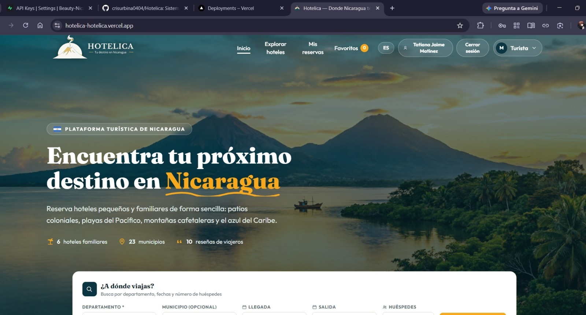
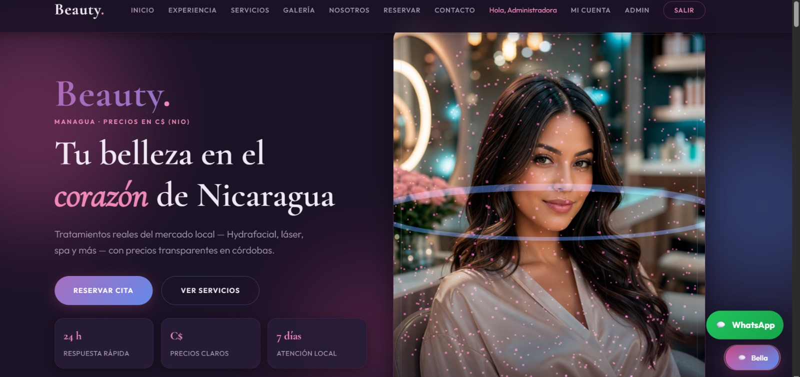

 

---

## 🎓 Sobre mí

- 🌐 **Me encanta el desarrollo web**: ver cómo una idea se convierte en una página que funciona es lo mejor
- 🎓 Estudiante de **Ingeniería en Sistemas de Información** en la UNP, Managua
- 🚀 Desarrolladora junior, construyendo bases sólidas y experimentando con tecnologías nuevas
- 🎨 Me apasionan las interfaces atractivas, claras y fáciles de usar
- 🎧 **Música + anime + código** = la combinación perfecta para mis proyectos

## 🛠️ Tecnologías

<table>
  <tr>
    <td align="center" width="33%" valign="top">
      <h3>🔨 Con lo que construyo</h3>
      
        
      <b>HTML • CSS • JavaScript • Git</b>
    </td>
    <td align="center" width="33%" valign="top">
      <h3>🌱 Aprendiendo y practicando</h3>
      
       
      
        
      <b>React • Python • SQL Server • Kotlin</b>
    </td>
    <td align="center" width="33%" valign="top">
      <h3>🚀 Quiero aprender</h3>
      
        
      <b>Node • TypeScript • Tailwind • Next.js • MongoDB • Figma</b>
    </td>
  </tr>
</table>

 

<i>💡 Estoy en camino de dominar estas herramientas: aprendo construyendo proyectos reales.</i>

## 📌 Proyectos destacados

<table>
  <tr>
    <td width="50%" valign="top">
      
      <h3>🏨 Hotelica</h3>
      
Sistema de reservación de hoteles para practicar lógica de programación y bases de datos.

      

        
        
      

      <a href="https://github.com/crisurbina0404/Hotelica">Ver repositorio →</a>
      &nbsp;•&nbsp;
      <a href="https://hotelica-hotelica.vercel.app">🌐 Ver demo en vivo →</a>
    </td>
    <td width="50%" valign="top">
      
      <h3>💄 Beauty Nicaragua</h3>
      
Aplicación web full stack para un salón de belleza en Managua: reservas, chat en tiempo real, panel de administración, recordatorios por WhatsApp y precios en córdobas.

      

        
        
        
        
      

      <a href="https://github.com/Tatiana-22MJ/beauty-nicaragua">Ver repositorio →</a>
      &nbsp;•&nbsp;
      <a href="https://web-production-6419f.up.railway.app">🌐 Ver demo en vivo →</a>
    </td>
  </tr>
</table>

## ⚡ Ahora mismo

- 🔨 Trabajando en **Hotelica**
- 📖 Profundizando en **React** y **bases de datos**
- 🎌 Anime favorito: Naruto Shippuden

## 📈 Metas actuales

- [ ] 🎯 Crear proyectos reales para consolidar mis habilidades
- [ ] ⚛️ Dominar React y su integración con bases de datos
- [ ] 🚀 Aprender nuevas tecnologías de desarrollo web para construir proyectos full-stack completos
- [ ] 🏨 Llevar Hotelica a una versión completa y desplegada

## 📊 Mis estadísticas

  
  
   
  

## 🐍 Mis contribuciones

  

## 📫 Conecta conmigo

  
  

 

  <i>"Todo experto fue alguna vez un principiante."</i> ✨

